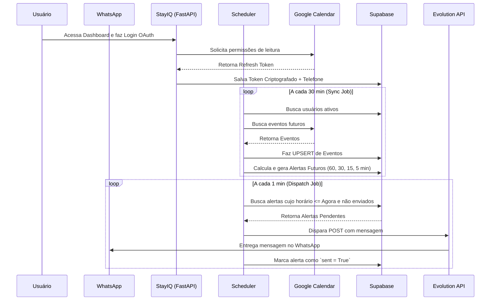

# StayIQ 🧠🛎️


**StayIQ** é um assistente inteligente via WhatsApp projetado para centralizar a gestão do dia a dia e automatizar lembretes.

---

## 📑 Sumário

- [O Porquê do Projeto (Propósito)](#-o-porquê-do-projeto-propósito)
- [Arquitetura e Stacks Escolhidas](#-arquitetura-e-stacks-escolhidas)
- [Fluxo de Funcionamento](#-fluxo-de-funcionamento)
- [Como Configurar os Serviços Externos](#-como-configurar-os-serviços-externos)
  - [1. Google Cloud Console (Agenda)](#1-google-cloud-console-agenda)
  - [2. Supabase (Banco de Dados)](#2-supabase-banco-de-dados)
  - [3. Evolution API (WhatsApp)](#3-evolution-api-whatsapp)
- [Como Rodar o Projeto Localmente](#-como-rodar-o-projeto-localmente)
- [Como Contribuir](#-como-contribuir)
- [Licença](#-licença)

---

## 🎯 O Porquê do Projeto (Propósito)

Este projeto nasceu como uma iniciativa de **Extensão Universitária (UNOPAR)** com um propósito social claro: **ajudar microempreendedores a retomarem o controle de seu tempo**.

### O Problema
Muitos microempreendedores — com destaque especial para **hosts e administradores de Airbnb** — lidam com agendas caóticas, sobrecarga de tarefas diárias e alto volume de comunicação. Essa sobrecarga resulta em compromissos perdidos, tarefas esquecidas (como coordenar limpeza e check-ins) e perda de qualidade de vida.

### A Solução
O **StayIQ** age como um assistente invisível que se conecta ao Google Calendar do usuário e envia lembretes proativos diretamente no **WhatsApp**, o canal de comunicação mais utilizado no Brasil. Isso garante que o usuário não precise ficar abrindo aplicativos de agenda o tempo todo; a informação chega até ele de forma antecipada e assertiva.

---

## 🏗️ Arquitetura e Stacks Escolhidas

O projeto foi construído pensando em simplicidade, manutenibilidade e baixo custo operacional.

| Tecnologia | O que é | Por que foi escolhida | Papel na Arquitetura |
|---|---|---|---|
| **Python + FastAPI** | Framework web assíncrono para Python. | É extremamente rápido, nativamente assíncrono e moderno. | Serve o dashboard Web, gerencia rotas OAuth e orquestra a comunicação entre o banco e as APIs. |
| **APScheduler** | Agendador de tarefas em background para Python. | Simples e roda diretamente na mesma thread do FastAPI, sem necessidade de ferramentas complexas (como Celery/RabbitMQ) para o MVP. | Roda o *Sync de Calendários* (a cada 30min) e o *Dispatch de Alertas* (a cada 1min). |
| **Supabase** | Backend-as-a-Service (BaaS) open-source baseado em PostgreSQL. | Oferece banco de dados robusto em nuvem gratuito (ótimo para projetos acadêmicos) e possui um *Connection Pooler* IPv4 nativo. | Armazena Usuários, Tokens Criptografados do Google, Eventos Sincronizados e os Alertas Agendados. |
| **Evolution API** | API open-source para integração com o WhatsApp via QR Code. | Gratuita, roda em Docker próprio e não depende da API Oficial paga da Meta, ideal para microempreendedores. | Responsável pelo envio real das mensagens no WhatsApp dos usuários. |
| **Google Calendar API** | API oficial da Google para gerenciar agendas. | É a ferramenta de agenda mais utilizada no mundo corporativo e pessoal. | Fornece a fonte da verdade dos eventos diários do host. |

---

## 🔄 Fluxo de Funcionamento

O StayIQ opera com base em sincronização assíncrona. Ele não bloqueia o usuário enquanto processa dados.



---

## ⚙️ Como Configurar os Serviços Externos

Para rodar este projeto, você precisa de credenciais de três serviços diferentes.

### 1. Google Cloud Console (Agenda)
1. Acesse o [Google Cloud Console](https://console.cloud.google.com/).
2. Crie um projeto novo.
3. Vá em **APIs & Services > Library** e ative a **Google Calendar API**.
4. Vá em **OAuth consent screen**, configure como "External", preencha os dados e adicione os escopos de `.../auth/calendar.readonly`, `email` e `profile`.
5. Em **Credentials**, crie um **OAuth client ID** (tipo Web Application).
6. Adicione as URIs de redirecionamento (ex: `http://localhost:8000/oauth/callback`).
7. Baixe o JSON gerado. Copie o conteúdo dele e cole na variável `GOOGLE_CREDENTIALS_JSON` do seu `.env`.

### 2. Supabase (Banco de Dados)
1. Crie uma conta/projeto no [Supabase](https://supabase.com/).
2. Vá em **Project Settings > Database** e desça até **Connection Pooler**.
3. Ative o Connection Pooler (para obter um Host IPv4 que o Docker consiga acessar) e copie o Host (`aws-X...pooler.supabase.com`) e Porta (`6543`).
4. Crie as tabelas necessárias no SQL Editor (o projeto necessita de tabelas para `users`, `events`, e `scheduled_alerts` no schema `stayiq`).
5. Preencha as variáveis `DB_HOST`, `DB_PORT`, `DB_USER`, `DB_NAME` e `PASSWORD_SUPABASE` no seu `.env`.

### 3. Evolution API (WhatsApp)
1. O docker-compose do projeto já sobe a Evolution API.
2. Acesse a API na porta configurada (ex: `http://localhost:8080`) usando seu `EVOLUTION_API_KEY`.
3. Crie uma nova instância através do endpoint de create instance.
4. Conecte o seu WhatsApp através do QR Code.
5. Certifique-se que o nome da instância criada é o mesmo valor configurado na variável `EVOLUTION_INSTANCE` do `.env`.

---

## 💻 Como Rodar o Projeto Localmente

### Pré-requisitos
- **Docker** e **Docker Compose** instalados.
- Arquivo `.env` corretamente configurado na raiz do projeto.

### 1. Configure o arquivo `.env`
Crie um arquivo `.env` baseado neste template:

```env
# Configurações do Supabase (Usar dados do Connection Pooler IPv4)
DB_HOST=aws-1-sa-east-1.pooler.supabase.com
DB_PORT=6543
DB_USER=postgres.SEU_PROJETO
DB_NAME=postgres
PASSWORD_SUPABASE=sua_senha_aqui

# Chave de Criptografia do App (Gere uma chave 32 bytes base64url)
ENCRYPTION_KEY=sua_chave_fernet_aqui
SECRET_KEY=sua_secret_key_de_sessao

# Configurações da Evolution API
EVOLUTION_API_URL=http://evolution_api:8080
EVOLUTION_API_KEY=sua_chave_api_escolhida
EVOLUTION_INSTANCE=nome_da_instancia_criada

# Configurações para a própria Evolution subir no Docker
EVOLUTION_DB_USER=evolution
EVOLUTION_DB_PASSWORD=evolution
EVOLUTION_DB_NAME=evolution_db

# Google OAuth
GOOGLE_REDIRECT_URI=http://localhost:8000/oauth/callback
GOOGLE_CREDENTIALS_JSON='{
    "web": {
        "client_id": "seu_client_id",
        "project_id": "seu_project_id",
        "auth_uri": "https://accounts.google.com/o/oauth2/auth",
        "token_uri": "https://oauth2.googleapis.com/token",
        "auth_provider_x509_cert_url": "https://www.googleapis.com/oauth2/v1/certs",
        "client_secret": "seu_client_secret"
    }
}'
```

### 2. Suba a aplicação com Docker

No terminal, na pasta raiz do projeto, rode:
```bash
docker compose up -d --build
```
Isso vai levantar três serviços cruciais:
- **`evolution_postgres`** e **`evolution_redis`** (Dependências da Evolution)
- **`evolution_api`** (Motor do WhatsApp)
- **`stayiq_app`** (Nosso servidor FastAPI)

*(Opcionalmente o `evolution_manager` subirá na porta 3000 para gerenciar a API visualmente)*.

### 3. Valide o funcionamento
1. **Verifique os logs da aplicação:**
   ```bash
   docker logs -f stayiq_app
   ```
   Você deverá ver mensagens de sucesso como: `🚀 StayIQ Dashboard iniciado` e `⏰ Scheduler iniciado`.
2. **Acesse a aplicação no navegador:**
   Abra `http://localhost:8000`. Você deverá ver a Landing Page e o botão para fazer Login com o Google.

---

## 🤝 Como Contribuir

1. Faça um Fork do projeto
2. Crie uma branch para sua Feature (`git checkout -b feature/SuaFeature`)
3. Faça o commit de suas mudanças (`git commit -m 'Add: nova feature incrível'`)
4. Faça o Push para a Branch (`git push origin feature/SuaFeature`)
5. Abra um Pull Request

---

## 📄 Licença

Distribuído sob a licença MIT. Veja `LICENSE` para mais informações.
